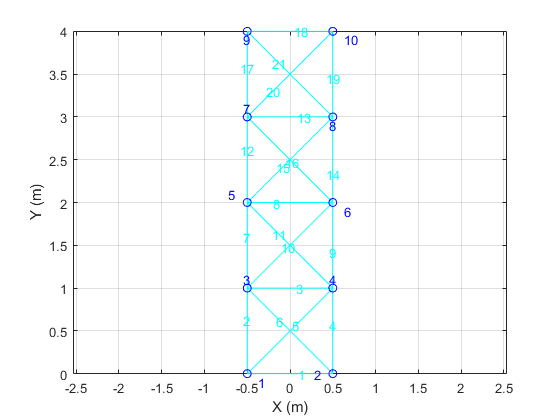
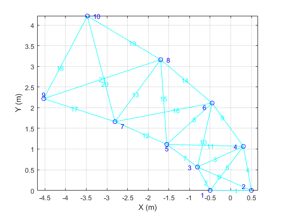
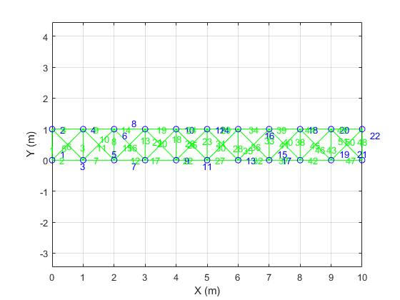
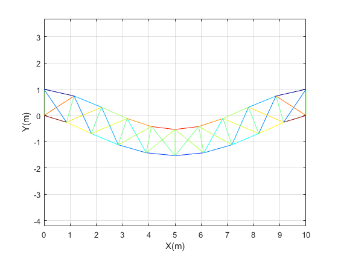
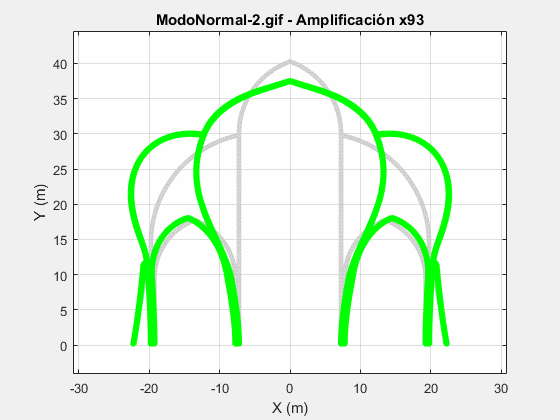
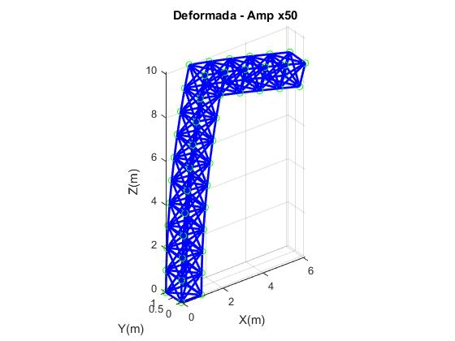
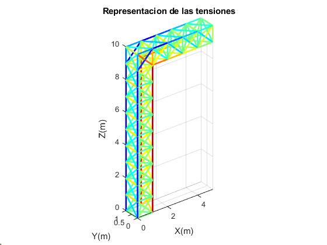
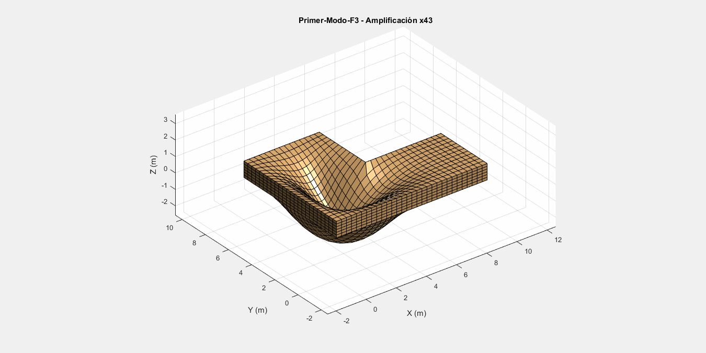
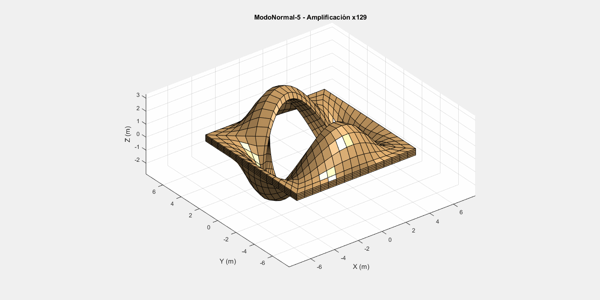

# solid-mechanics
These programs will help you generate different solid structures using bar segments and finite elements. It can also simulate of static and dynamic response after stresses and plot the stationary and transient deformation of the original structure. Furthermore, it can also plot the displacement on each node and plot it as a graph vs time or plot the trajectory. Each section contains a "Method.pdf" where all the functions and the programs logic is explained. 
In conclusion, this repository offers a basic-level, user-friendly programs to lear how to generate and simulate solid structures. 

### 1-VerticalBeam:
Generates a vertical beam by saving the information of nodes and bars in a matrix. Then, the deformation after a vertical force on node 9 is calculated by assembling the stiffness matrix and obtaining each node displacement. The plot of the deformation is amplified by a factor to emphasize the displacements.

 

### 2-HorizontalBeam:
Generates an horizontal beam by saving the information of nodes and bars in a matrix. Then, it calculates de deformation due to its self-weight by assembling the stiffness matrix and obtaining the displacements of each node. Finally, the bar stresses and reactions in bearings are also obtained. The code plots each bar with a color code associated to its stress magnitude.

 

### 3-Cathedral:
Using the bar and nodes stored in an excel sheet, the code obtains dynamic response of a cathedral shaped structure after an oscillating force is applied. The code obtains the vibration modes of the structure and resolves the transient behavior for a specific time instance. It can also generate each node displacement and plot its trajectory or its amplitude vs time. Finally, the deformation of the structure is represented as a video or as a static picture for a selected time t. 

 

### 4-Cantilever
The CantileverPt1 program generates a grid model for a cantilever (pillar+horizontal beam) and stores the data in an Excel file. Then, CantileverPt2 calculates the stiffness matrix, displacements and bar stresses on the structure generated in Pt1, when a vertical force of 4840N is applied in node 57 -coords (5,0,10).

 

### 5-LshapedPlate
This program is a bit different from the previous ones. Using brick-like finite elements, a L-shaped plate is modelled- Ej1 generates the mesh, Ej2 does the assemble of mass and stiffness matrixes and obtains the resonance frequencies, to the plot the chosen vibration mode. Finally, Ej3 performs a mesh study to check for accuracy vs computing time needed to obtain and plot the vibration modes. 

 

### 6-MultiMaterialPlatewithHole
The goal of this section is to generate a proper mesh for a polyurethane plate with a hole layered in aluminum. First, the mass and stiffness matrixes are assembled. Then, the static response to a vertical force F is calculated and finally, the dynamic response is simulated, obtaining the resonance frequencies and plotting the vibration modes. This is the most complex and complete program within all 6 sections. 

 

These programs have been developed with the knowledge obtained in the GITI subject: "Análisis de sistemas físicos de utilidad en ingenieria con Octave/MatLab" given by professor Jesús de Vicente y Oliva [link: https://moodle.upm.es/titulaciones/oficiales/course/view.php?id=5893]

